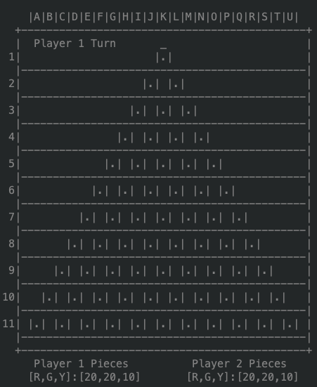
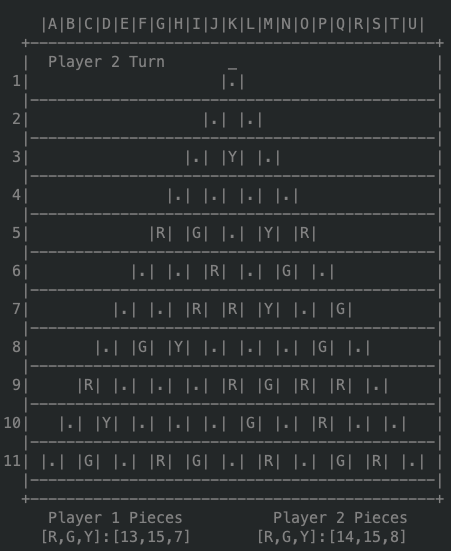
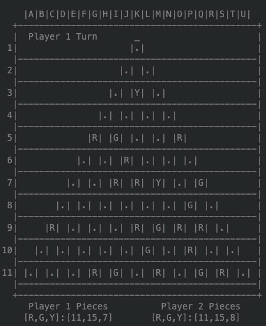

# Ampel

## Identification

* **Game:** Ampel
* **Group:** Ampel_4
* **Class:** 5
* **Students:**
    * André Mamprin Mori - up201700493
    * Muriel Pinho - up201700132


## Game Description

The rulebook can be found in the ```docs/``` folder.

Ampel is a board game for two players with the objective of positioning three discs in a line to match the sequence of a traffic light (red-yellow-green, in any direction). Who has made more sequences wins.

The game starts with an empty board (with 66 connected points) and each player selects a color: green or red. Starting with a random player begins the setup phase: players take turns to place a yellow disc in a random place of the board (except edges) until there are 5 yellow discs.

After the setup phase is complete, the main game starts. On each turn, players must perform the following steps if possible (in order):
* Move one of your discs.
* Move one of your opponent's discs without a cylinder on it.
* Add one of your discs to an empty point (without directly making a traffic light) and put your cylinder on it, moving the cylinder if it's on the board. When out of discs, remove cylinder from the board.

The disc movement must follow these rules:
* It must move in a straight line along the lines of the connected points.
* The spaces it must move is equal to the number of discs (counting itself) in the same line.
* The disc can change direction when moving when encountering an obstacle, being able to go any direction except backwards.
* If there isn't enough room for the disc to move the number of spaces, the player can't move it.

If a player makes a traffic light, he keeps the yellow disc and returns the other pieces to its player. The game ends when a player has taken the majority of yellow pieces on the board.


## GameState Implementation

The GameState is implemented in a list containing 3 lists:
1. Represents the board in a 26x11 Matrix containing atoms for the following:
    - **red** represents the *Red* pieces.
    - **green** represents the *Green* pieces.
    - **yellow** represents the *Yellow* pieces.
    - **empty** represents the *Empty* or *Playable* spaces.
    - **board** and **blank** represent *Unplayable* spaces but they transalate into different things when the board is displayed.
        - **board** translates into 2 spaces.
        - **blank** translates into 1 space.

2. Represents the pieces available to be played for Player 1, formatted as [R,G,Y] with R for *Red* pieces available, G for *Green* pieces available and Y for *Yellow* pieces available.
3. Represents the pieces available to be played for Player 2, formatted as [R,G,Y] with R for *Red* pieces available, G for *Green* pieces available and Y for *Yellow* pieces available.

### GameState Examples

- **Initial State**
    - Description:
        Initial Board with all playable spaces empty and players with default number of pieces of each color.
        *Player 1* has 20 *Red* pieces, 20 *Green* pieces and 10 *Yellow* pieces.
        *Player 2* has 20 *Red* pieces, 20 *Green* pieces and 10 *Yellow* pieces.
    - Prolog representation:
    ```pl
    initialState([[
    [board,board,board,board,board,board,board,board,board,board,empty,board,board,board,board,board,board,board,board,board,board],
    [board,board,board,board,board,board,board,board,board,empty,blank,empty,board,board,board,board,board,board,board,board,board],
    [board,board,board,board,board,board,board,board,empty,blank,empty,blank,empty,board,board,board,board,board,board,board,board],
    [board,board,board,board,board,board,board,empty,blank,empty,blank,empty,blank,empty,board,board,board,board,board,board,board],
    [board,board,board,board,board,board,empty,blank,empty,blank,empty,blank,empty,blank,empty,board,board,board,board,board,board],
    [board,board,board,board,board,empty,blank,empty,blank,empty,blank,empty,blank,empty,blank,empty,board,board,board,board,board],
    [board,board,board,board,empty,blank,empty,blank,empty,blank,empty,blank,empty,blank,empty,blank,empty,board,board,board,board],
    [board,board,board,empty,blank,empty,blank,empty,blank,empty,blank,empty,blank,empty,blank,empty,blank,empty,board,board,board],
    [board,board,empty,blank,empty,blank,empty,blank,empty,blank,empty,blank,empty,blank,empty,blank,empty,blank,empty,board,board],
    [board,empty,blank,empty,blank,empty,blank,empty,blank,empty,blank,empty,blank,empty,blank,empty,blank,empty,blank,empty,board],
    [empty,blank,empty,blank,empty,blank,empty,blank,empty,blank,empty,blank,empty,blank,empty,blank,empty,blank,empty,blank,empty]],
    [20,20,10],
    [20,20,10]]).
    ```
    - Console Representation:

    

- **Midgame State**
    - Description:
        Midgame Board with empty spaces and spaces with pieces.
        *Player 1* has 13 *Red* pieces, 15 *Green* pieces and 7 *Yellow* pieces.
        *Player 2* has 14 *Red* pieces, 15 *Green* pieces and 8 *Yellow* pieces.
    - Prolog representation:
    ```pl
    midState([[
    [board,board,board,board,board,board,board,board,board,board,empty,board,board,board,board,board,board,board,board,board,board],
    [board,board,board,board,board,board,board,board,board,empty,blank,empty,board,board,board,board,board,board,board,board,board],
    [board,board,board,board,board,board,board,board,empty,blank,yellow,blank,empty,board,board,board,board,board,board,board,board],
    [board,board,board,board,board,board,board,empty,blank,empty,blank,empty,blank,empty,board,board,board,board,board,board,board],
    [board,board,board,board,board,board,red,blank,green,blank,empty,blank,yellow,blank,red,board,board,board,board,board,board],
    [board,board,board,board,board,empty,blank,empty,blank,red,blank,empty,blank,green,blank,empty,board,board,board,board,board],
    [board,board,board,board,empty,blank,empty,blank,red,blank,red,blank,yellow,blank,empty,blank,green,board,board,board,board],
    [board,board,board,empty,blank,green,blank,yellow,blank,empty,blank,empty,blank,empty,blank,green,blank,empty,board,board,board],
    [board,board,red,blank,empty,blank,empty,blank,empty,blank,red,blank,green,blank,red,blank,red,blank,empty,board,board],
    [board,empty,blank,yellow,blank,empty,blank,empty,blank,empty,blank,green,blank,empty,blank,red,blank,empty,blank,empty,board],
    [empty,blank,green,blank,empty,blank,red,blank,green,blank,empty,blank,red,blank,empty,blank,green,blank,red,blank,empty]],
    [13,15,7],
    [14,15,8]]).
    ```
    - Console Representation:

    

- **Final State**
    - Description:
        Final Board with empty spaces and spaces with pieces.
        *Player 1* has 11 *Red* pieces, 15 *Green* pieces and 7 *Yellow* pieces.
        *Player 2* has 11 *Red* pieces, 15 *Green* pieces and 8 *Yellow* pieces.
    - Prolog representation:
    ```pl
    finalState([[
    [board,board,board,board,board,board,board,board,board,board,empty,board,board,board,board,board,board,board,board,board,board],
    [board,board,board,board,board,board,board,board,board,empty,blank,empty,board,board,board,board,board,board,board,board,board],
    [board,board,board,board,board,board,board,board,empty,blank,yellow,blank,empty,board,board,board,board,board,board,board,board],
    [board,board,board,board,board,board,board,empty,blank,empty,blank,empty,blank,empty,board,board,board,board,board,board,board],
    [board,board,board,board,board,board,red,blank,green,blank,empty,blank,empty,blank,red,board,board,board,board,board,board],
    [board,board,board,board,board,empty,blank,empty,blank,red,blank,empty,blank,empty,blank,empty,board,board,board,board,board],
    [board,board,board,board,empty,blank,empty,blank,red,blank,red,blank,yellow,blank,empty,blank,green,board,board,board,board],
    [board,board,board,empty,blank,empty,blank,empty,blank,empty,blank,empty,blank,empty,blank,green,blank,empty,board,board,board],
    [board,board,red,blank,empty,blank,empty,blank,empty,blank,red,blank,green,blank,red,blank,red,blank,empty,board,board],
    [board,empty,blank,empty,blank,empty,blank,empty,blank,empty,blank,green,blank,empty,blank,red,blank,empty,blank,empty,board],
    [empty,blank,empty,blank,empty,blank,red,blank,green,blank,empty,blank,red,blank,empty,blank,green,blank,red,blank,empty]],
    [11,15,7],
    [11,15,8]]).
    ```
    - Console Representation:

    

### GameState Visualization

The visualization works through the **display_game** function, it receives the current gameState and the current player and displays the board accordingly. The function **display_game** starts by printing board related info, then it calls **printMatrix** which receives the Head of gameState that contains the gameBoard, **printMatrix** prints the matrix contents recursively using **printLine** while also formatting for the contents to be displayed correctly and aligned. When **printMatrix** ends, the **printPieces** function is called receiving the Tail of the gameState which containts the gamePieces and displays them, ending the **display_game** function.

### Main Functions Code

The source code can be found in the ```src/``` folder.

**display_game**
```pl
display_game([GameBoard|GamePieces],Player) :-
    nl,
    write('    |A|B|C|D|E|F|G|H|I|J|K|L|M|N|O|P|Q|R|S|T|U|  \n'),
    write('  +---------------------------------------------+\n'),
    write('  |  '),
    write(Player),
    write(' Turn       _                      |\n'),
    printMatrix(GameBoard, 1),
    write('  +---------------------------------------------+\n'),
    write('     Player 1 Pieces          Player 2 Pieces    \n'),
    printPieces(GamePieces).
    printMatrix([], 12).

```
**printMatrix**
```pl
printMatrix([Head|Tail], N) :-
    indice(N, I),
    write(I),
    write(' '),
    N1 is N + 1,
    printLine(Head),
    write(' |'),
    write('\n  |---------------------------------------------|\n'),
    printMatrix(Tail, N1).
    printLine([]).
```
**printLine**
```pl
printLine([Head|Tail]) :-
    symbol(Head, S),
    write(S),
    printLine(Tail).
```

**printPieces**
```pl
printPieces([Player1,Player2]) :-
    write('    [R,G,Y]:'),
    write(Player1),
    write('       [R,G,Y]:'),
    write(Player2).
```


