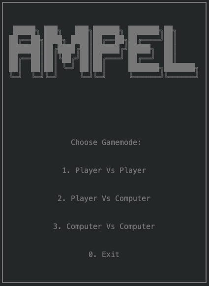

# Ampel

## Identification

* **Game:** Ampel
* **Group:** Ampel_4
* **Class:** 5
* **Students:**
    * André Mamprin Mori - up201700493
    * Muriel Pinho - up201700132


## Installation and Execution

To run the program, open SICStus and run the following command to consult the files
```pl
consult('src/Ampel.pl').
```
and then the following command
```pl
play.
```
to start the game.


## Game Description

The rulebook can be found in the ```docs/``` folder.

Ampel is a board game for two players with the objective of positioning three discs in a line to match the sequence of a traffic light (red-yellow-green, in any direction). Who has made more sequences wins.

The game starts with an empty board (with 66 connected points) and each player selects a color: green or red. Starting with a random player begins the setup phase: players take turns to place a yellow disc in a random place of the board (except edges) until there are 5 yellow discs.

After the setup phase is complete, the main game starts. On each turn, players must perform the following steps if possible (in order):
* Move one of your discs.
* Move one of your opponent's discs without a cylinder on it.
* Add one of your discs to an empty point (without directly making a traffic light) and put your cylinder on it, moving the cylinder if it's on the board. When out of discs, remove cylinder from the board.

The disc movement must follow these rules:
* It must move in a straight line along the lines of the connected points.
* The spaces it must move is equal to the number of discs (counting itself) in the same line.
* The disc can change direction when moving when encountering an obstacle, being able to go any direction except backwards.
* If there isn't enough room for the disc to move the number of spaces, the player can't move it.

If a player makes a traffic light, he keeps the yellow disc and returns the other pieces to its player. The game ends when a player has taken the majority of yellow pieces on the board.

## Game Logic

When running the command `play.` to start the game, the player is prompted with the Main Menu screen, where he can choose the type of game and difficulty (if using a bot).



After this, the game starts by creating the [Initial State](#gamestate-examples) and calling the `initialize` function, which asks for the players to place the initial yellow pieces, or requests the placement moves from the bots.

When the initialization is completed, the main game loop starts by calling the function `gameLoop(+GameState,+Player,+Mode,+Difficulty)`. This willl be a loop that will call `playerTurn(+GameState, +CurrentPlayer, +NextPlayer, -NextGameState)` or `botTurn(+GameState, +CurrentPlayer, +NextPlayer, +Difficulty, -NextGameState)`, swapping `CurrentPlayer` and `NextPlayer`each iteration. Those functions are responsible for each turn of the player, ensuring they will follow the 3 required steps, as explained in the [game description](#game-description) section.

Each piece movement made by the player will be followed by a verification to check if there has been a winner,game_over(+GameState, -Winner), or if a player has created an ampel using `checkAmpel(+Board,+Row,+Col,-Ampel,-FinalBoard)`, giving him points and returning the pieces to it's owners with `updateAfterAmpel(+GameState, +Player, -FinalState)`. The game ends when a player has captured more than half of the yellow discs by creating ampels.

### GameState Implementation

The GameState is implemented in a matrix containing 4 lists:
1. Represents the board in a 11x11 Matrix containing atoms for the following:
    - **red** represents the *Red* pieces.
    - **green** represents the *Green* pieces.
    - **yellow** represents the *Yellow* pieces.
    - **empty** represents the *Empty* or *Playable* spaces.
    - **blank** represents *Unplayable* spaces and it translates into into 1 empty space to be displayed.
2. Represents the current game score, fomatted as **[Player 1 Score, Player 2 Score]**.
3. Represents the color and pieces available to be played for Player 1, formatted as **[Color, Pieces]** with R for *Red* pieces available, G for *Green* pieces available and Y for *Yellow* pieces available.
4. Represents the color and pieces available to be played for Player 2, formatted as **[Color, Pieces]** with R for *Red* pieces available, G for *Green* pieces available and Y for *Yellow* pieces available.

#### GameState Examples

- **Initial State**
    - Description:
        Initial Board with all playable spaces empty and players with default number of pieces of each color.
        Score for both player is set to 0.
        *Player 1* has 20 *Green* pieces.
        *Player 2* has 20 *Red* pieces.
    - Prolog representation:
```pl
[
    [[empty,blank,blank,blank,blank,blank,blank,blank,blank,blank,blank],
    [empty,empty,blank,blank,blank,blank,blank,blank,blank,blank,blank],
    [empty,empty,empty,blank,blank,blank,blank,blank,blank,blank,blank],
    [empty,empty,empty,empty,blank,blank,blank,blank,blank,blank,blank],
    [empty,empty,empty,empty,empty,blank,blank,blank,blank,blank,blank],
    [empty,empty,empty,empty,empty,empty,blank,blank,blank,blank,blank],
    [empty,empty,empty,empty,empty,empty,empty,blank,blank,blank,blank],
    [empty,empty,empty,empty,empty,empty,empty,empty,blank,blank,blank],
    [empty,empty,empty,empty,empty,empty,empty,empty,empty,blank,blank],
    [empty,empty,empty,empty,empty,empty,empty,empty,empty,empty,blank],
    [empty,empty,empty,empty,empty,empty,empty,empty,empty,empty,empty]],
    [0,0],
    [green,20],
    [red,20]
]
```

- **Mid State**
    - Description:
        Board with 3 remaining yellow pieces with some red/green placed around the board.
        Score is set to **[1, 2]**, meaning the second player is ahead.
        *Player 1* has 14 *Green* pieces left.
        *Player 2* has 15 *Red* pieces left.
    - Prolog representation:
```pl
[
    [[empty,blank,blank,blank,blank,blank,blank,blank,blank,blank,blank],
    [empty,empty,blank,blank,blank,blank,blank,blank,blank,blank,blank],
    [red,empty,green,blank,blank,blank,blank,blank,blank,blank,blank],
    [empty,empty,empty,empty,blank,blank,blank,blank,blank,blank,blank],
    [green,yellow,empty,empty,empty,blank,blank,blank,blank,blank,blank],
    [empty,empty,empty,red,empty,empty,blank,blank,blank,blank,blank],
    [empty,green,empty,empty,empty,empty,empty,blank,blank,blank,blank],
    [empty,empty,empty,empty,green,empty,empty,empty,blank,blank,blank],
    [red,empty,empty,yellow,empty,empty,yellow,empty,empty,blank,blank],
    [empty,empty,red,empty,green,empty,red,green,empty,empty,blank],
    [empty,empty,empty,empty,empty,empty,empty,empty,empty,empty,empty]],
    [1,2],
    [green,14],
    [red,15]
]
```

- **Final State**
    - Description:
        Board with 2 remaining yellow pieces with some red/green placed around the board.
        Score is set to **[3, 2]**, meaning the first player has won.
        *Player 1* has 14 *Green* pieces left.
        *Player 2* has 15 *Red* pieces left.
    - Prolog representation:
```pl
[
    [[empty,blank,blank,blank,blank,blank,blank,blank,blank,blank,blank],
    [empty,empty,blank,blank,blank,blank,blank,blank,blank,blank,blank],
    [red,empty,green,blank,blank,blank,blank,blank,blank,blank,blank],
    [empty,empty,empty,empty,blank,blank,blank,blank,blank,blank,blank],
    [green,yellow,empty,empty,empty,blank,blank,blank,blank,blank,blank],
    [empty,empty,empty,red,empty,empty,blank,blank,blank,blank,blank],
    [empty,green,empty,empty,empty,empty,empty,blank,blank,blank,blank],
    [empty,empty,empty,empty,green,empty,empty,empty,blank,blank,blank],
    [red,empty,empty,yellow,empty,empty,empty,empty,empty,blank,blank],
    [empty,empty,red,empty,green,empty,red,green,empty,empty,blank],
    [empty,empty,empty,empty,empty,empty,empty,empty,empty,empty,empty]],
    [3,2],
    [green,14],
    [red,15]
]
```


### GameState Visualization

The visualization works through the **display_game** function, it receives the current gameState and the current player and displays the board accordingly. The function **display_game** starts by printing board related info, then it calls **printMatrix** which receives the Head of gameState that contains the gameBoard, **printMatrix** prints the matrix contents recursively using **printLine** while also formatting for the contents to be displayed correctly and aligned. When **printMatrix** ends, the **printPieces** function is called receiving the Tail of the gameState which containts the gamePieces and displays them, ending the **display_game** function.

### Make Move
When a player is going to make a move, first he must choose the piece he is going to move in the function `selectPiece(+GameBoard, +Color, -Row, -Col)` which will be used to get and validate his input, so after the he can choose the direction the piece will move in the function `selectMoveOption(-Direction)`. With the selected piece and direction, the function `move(+GameState,+Move,-NewGameState)` is called to validate and perform the move chosen by the player returning the new game state.

### Game Over
Every time a player perfoms a move in the `playerTurn(+GameState, +Player, +NextPlayer, -NextGameState)` function, `game_over(+GameState, -Winner)​` is called to check if the move has resulted in a win for the player, the player captured more than half the total yellow pieces on the board by creating ampels, the function returns the winner (if any) in the `Winner` parameter.

### Board Value
To determine the value of the current board, the function `value(+GameState, +Player, -Value)​` is called. It goes through all the elements in the game board from the GameState and returns the total number of pieces placed. The lower the value, the better the play is because there is more space/options for the player to make and less pieces means a higher probability of a ampel having happened.

### Bot Gameplay

The bot uses the function `choose_move(+GameState, +Player, +Level, -Move)` to switch between two different functions for moves, the first is `moveBotPieceRandom(+GameState, +Player, +Color, -NextGameState,-Move)`, where the bot tries a random move and doesn't verify it it is valid or not, resulting if poor decision making, the second is `moveBotPieceValid(+GameState, +Player, +Color, -NextGameState,-Move)`, where the bot recursively searchs for a valid move using randomly generated numbers, it makes for way better decision making.

## Conclusion
The project's main goal was to use the knowledge acquired from the Logic Programming classes and create a game using the Prolog language, as progamming games makes for an great learning tool.

During the development of the project, difficulties were encountered, which led to problems regarding the overall functionality of the game. These difficulties were present mostly because of the complexity of the Ampel game and the nature of the Prolog language as it is a really different language and it requires a certain way of thinking.

Some possible enhancements would include the optimization of the functions used and a better performance for the bots (by making decisions less randomly). There are some minor bugs including the game over verification and some ampels not being detected on bot games, which could have been fixed with more time.

Overall, the project taught us about the capacity of the Prolog language ,how to solve all kind of problems in a different way and how to think outside of our normal coding mindset.

## Bibliography

* [Ampel](https://nestorgames.com/#ampel_detail)
* [SICStus Documentation](https://sicstus.sics.se/sicstus/docs/latest4/html/sicstus.html/)
